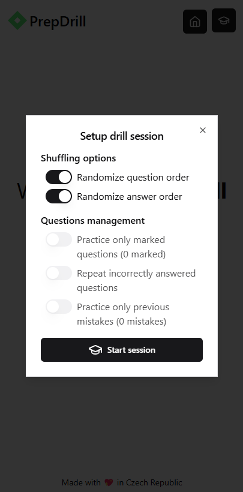

# PrepDrill

**PrepDrill** is a modern, interactive study app for quiz-based learning and exam preparation — built with React, TypeScript, and Tailwind CSS as a Progressive Web App (PWA).

🔗 **[Live Demo](https://vojtechsanda.github.io/prep-drill/)**

## Table of Contents

- [🖼️ Screenshots](#----screenshots)
- [🚀 Features](#---features)
- [🛠️ Tech Stack](#----tech-stack)
- [🎯 Usage](#---usage)
  - [Getting Started](#getting-started)
  - [Question Format](#question-format)
- [📦 Installation](#---installation)
- [🚀 Development](#---development)
  - [Available Scripts](#available-scripts)
  - [Project Structure](#project-structure)
  - [Key Components](#key-components)
- [🌐 Internationalization](#---internationalization)

## 🖼️ Screenshots

Here’s a quick look at PrepDrill’s mobile interface:

| Home Page                                | Session Setup                     |
| ---------------------------------------- | --------------------------------- |
|  |  |

| Quiz Question                           | Answer Review                                       | Results Summary                                |
| --------------------------------------- | --------------------------------------------------- | ---------------------------------------------- |
|  |  |  |

👉 Try it yourself in the **[Live Demo](https://vojtechsanda.github.io/prep-drill/)**!

## 🚀 Features

| Feature                       | Description                                                     |
| ----------------------------- | --------------------------------------------------------------- |
| **Interactive Quiz Sessions** | Create and run practice sessions with multiple-choice questions |
| **Progress Tracking**         | Monitor your performance and track learning progress            |
| **Demo Questions**            | Pre-loaded sample questions to check out the application        |
| **Internationalization**      | Built-in support for multiple languages using `react-intl`      |
| **PWA Support**               | Installable from your browser with offline capabilities         |
| **Modern UI**                 | A clean, responsive design with Tailwind CSS and Shadcn         |
| **Local Storage**             | All data stored locally in your browser using `LocalStorage`    |

## 🛠️ Tech Stack

| Category                 | Technology                          |
| ------------------------ | ----------------------------------- |
| **Frontend**             | React 18 with TypeScript            |
| **Build Tool**           | Vite                                |
| **Styling**              | Tailwind CSS with custom components |
| **State Management**     | TanStack Query                      |
| **Routing**              | React Router v6                     |
| **Forms**                | React Hook Form + Zod               |
| **UI Components**        | Shadcn and Radix UI                 |
| **Icons**                | Lucide React                        |
| **PWA**                  | Vite PWA plugin                     |
| **Internationalization** | React Intl (FormatJS)               |

## 🎯 Usage

### Getting Started

1. **Load Demo Questions**: Click "Load Demo Questions" to get started with sample questions
2. **Import Questions**: Use the import feature to add your own questions in the supported format
3. **Start a Session**: Configure your practice session settings and begin drilling

### Question Format

Questions can be imported in a simple text format:

```
What is the capital of France?
>>>Paris
London
Rome
Berlin

Which of the following cities are capital cities?
>>>Prague
Brno
Munich
>>>Berlin
```

- First line is for the question text
- The other lines are for answers
- Correct answers are marked with `>>>` prefix
  - Multiple correct answers are supported
- Empty line separates questions

## 📦 Installation

1. Clone the repository:

```bash
git clone https://github.com/vojtechsanda/prep-drill.git
cd prep-drill
```

2. Install dependencies:

```bash
pnpm install
```

3. Start the development server:

```bash
pnpm dev
```

## 🚀 Development

### Available Scripts

| Script                     | Description                   |
| -------------------------- | ----------------------------- |
| `pnpm dev`                 | Start development server      |
| `pnpm build`               | Build for production          |
| `pnpm preview`             | Preview production build      |
| `pnpm lint`                | Run ESLint                    |
| `pnpm msg:extract`         | Extract translatable messages |
| `pnpm generate-pwa-assets` | Generate PWA icons            |

### Project Structure

```
src/
├── components/    # Reusable UI components
├── hooks/         # Custom React hooks
├── lang/          # Internationalization files
├── lib/           # Utility functions
├── pages/         # Page components
├── providers/     # Context providers
├── routes/        # Router configuration
├── schemas/       # Zod validation schemas
├── store/         # State management
└── types/         # TypeScript type definitions
```

### Key Components

- **Home Page**: Main dashboard for question management
- **Session Page**: Quiz interface with question navigation
- **Question Card**: Individual question display component
- **Import Dialog**: Question import functionality
- **Settings Panel**: User preference management

## 🌐 Internationalization

The app supports multiple languages using react-intl:

- Message extraction: `pnpm msg:extract`
- Language files located in `src/lang/messages/`
- Currently supports English, Czech and Slovak with structure for additional languages

## 🙏 Acknowledgments

- Built with [React](https://reactjs.org/)
- UI components from [Shadcn](https://ui.shadcn.com/) and [Radix UI](https://www.radix-ui.com/)
- Icons from [Lucide](https://lucide.dev/)
- Styling with [Tailwind CSS](https://tailwindcss.com/)

## 📄 License

This project is licensed under the MIT License – see the [LICENSE](./LICENSE) file for details.

## 📧 Support

If you have any questions or need help, please [open an issue](https://github.com/vojtechsanda/prep-drill/issues/new) on GitHub.

---

Made with 💖 by [Vojtěch Šanda](https://vojtechsanda.cz)
